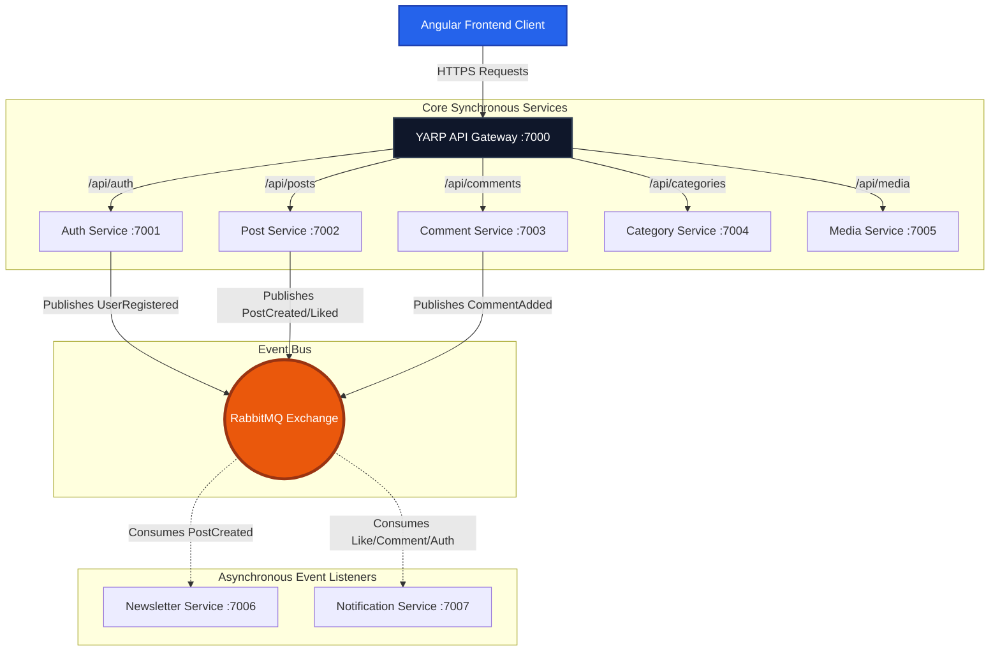

# 🖋️ InkWell Platform Backend


Welcome to the **InkWell Backend Platform**, a highly scalable, industry-grade publishing ecosystem. Designed with **Clean Architecture** and **Event-Driven Communication** principles, InkWell completely decouples core operational domains (Auth, Posts, Categories) from asynchronous side-effects (Newsletters, Notifications) using a robust MassTransit/RabbitMQ service bus.

---

## 🏗️ High-Level Architecture

The platform operates as a suite of isolated microservices unified behind a central YARP Reverse Proxy.



---

## 📦 Microservice Topology

Each domain is segregated into its own service repository to allow independent scaling, deployment, and technology choices.

1. **`InkWell.API.Gateway`**: The YARP-powered reverse proxy managing CORS and request routing.
2. **`InkWell.AuthService`**: Manages Identity, JWT Issuance, Google OAuth, and Role-Based Access Control.
3. **`InkWell.PostService`**: The core domain managing Rich-Text Stories, Slugs, and Analytics.
4. **`InkWell.CommentService`**: Manages recursive community discussions and comment moderation.
5. **`InkWell.CategoryService`**: Provides structured taxonomy and tag metadata.
6. **`InkWell.MediaService`**: Handles multipart binary uploads and static file asset delivery.
7. **`InkWell.NewsletterService`**: Mass-broadcasts HTML emails asynchronously to active subscribers.
8. **`InkWell.NotificationService`**: Real-time aggregation of platform events into in-app alerts and targeted emails.

---

## 🔀 Git Branching Strategy (Feature-Driven Development)

This repository follows a strict feature-branch workflow. Each independent module was developed in isolation before being integrated into the `dev` branch.

- `dev` *(Integration Branch)*
  - `feature/UC-1-Gateway-Shared`
  - `feature/UC-2-Auth-Service`
  - `feature/UC-3-Post-Service`
  - `feature/UC-4-Comment-Service`
  - `feature/UC-5-Category-Service`
  - `feature/UC-6-Media-Service`
  - `feature/UC-7-Newsletter-Service`
  - `feature/UC-8-Notification-Service`

*(Note: Explore the specific `UC-*-README.md` files in those branches for deep technical dives into individual services).*

---

## 🚀 Running the Environment Locally

### 1. Prerequisites
- **.NET 8.0 SDK**
- **SQL Server Express/Developer Edition** (Ensure Mixed Mode Authentication is enabled)
- **Docker Desktop** (For running the Message Broker)

### 2. Infrastructure Setup
Start the local RabbitMQ instance via Docker:
```powershell
docker run -d --hostname inkwell-rabbit --name rabbitmq-inkwell -p 5672:5672 -p 15672:15672 rabbitmq:3-management
```
*Access RabbitMQ Dashboard at `http://localhost:15672` (guest/guest).*

### 3. Database Configurations
Ensure your local `SAURABH-PANDIT` (or equivalent) connection strings are correctly mapped in all `appsettings.json` files within `src/*/`. Run EF Migrations if not already applied.

### 4. Bootstrapping the Services
To launch the full backend suite, execute the following in separate terminals:

```powershell
# Core Gateway
cd gateway\InkWell.API.Gateway; dotnet run

# Microservices
cd src\InkWell.AuthService; dotnet run
cd src\InkWell.PostService; dotnet run
cd src\InkWell.CommentService; dotnet run
cd src\InkWell.CategoryService; dotnet run
cd src\InkWell.MediaService; dotnet run
cd src\InkWell.NewsletterService; dotnet run
cd src\InkWell.NotificationService; dotnet run
```

The unified API will be accessible strictly via `http://localhost:7000/api/{resource}`.

---

## 🛡️ Security Posture
- Passwords are unconditionally hashed via **BCrypt**.
- Internal communication assumes local trust; external requests are strictly authenticated via asymmetric **JWTs**.
- Database schemas are entirely segregated at the Entity Framework `DbContext` layer.
