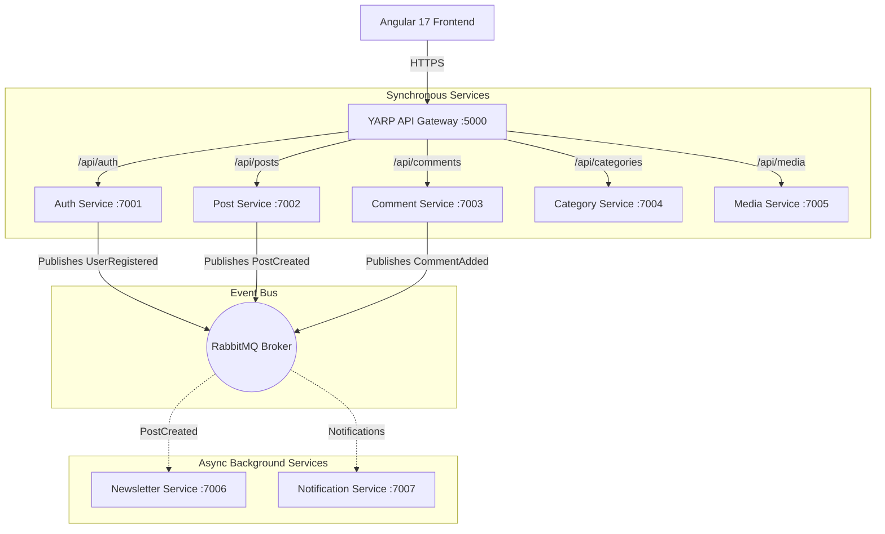

# 🖋️ InkWell - Full-Stack Microservices Blogging Platform

[](https://dotnet.microsoft.com/en-us/download/dotnet/8.0)
[](https://angular.io/)
[](https://masstransit.io/)
[](https://www.rabbitmq.com/)
[](https://www.sonarqube.org/)

InkWell is a high-performance, industry-grade blogging ecosystem designed with **Microservices Architecture**, **Clean Architecture**, and **Event-Driven Communication**. It provides a premium publishing experience with role-based dashboards, asynchronous notifications, and a highly responsive frontend.

---

## 🏗️ Technical Architecture

InkWell follows a decoupled microservices approach, unified behind a centralized **YARP API Gateway**. Core business domains are isolated into independent services, while side-effects like notifications and newsletters are handled asynchronously via **RabbitMQ**.

### System Topology


---

## 🚀 Key Features

### 🔐 Enterprise Identity Management
*   **JWT-Based Auth**: Secure stateless authentication with asymmetric keys.
*   **RBAC**: Role-Based Access Control (Admin, Author, Reader).
*   **Google OAuth**: Seamless one-tap login integration.

### 📝 Content & Community
*   **Rich Text Publishing**: Full-featured blog creation with dynamic slug generation.
*   **Recursive Comments**: Threaded discussions with moderation logic.
*   **Engagement**: Integrated Like, Save, and Share functionalities with real-time counters.

### 📡 Asynchronous Workflows
*   **Broadcast Notifications**: RabbitMQ-powered alerts for comments and follows.
*   **Newsletter Engine**: Double opt-in subscription workflow with automated HTML email delivery.

### 🎨 Premium UI/UX
*   **Modern Aesthetics**: Glassmorphism and modern typography for a high-end feel.
*   **Performance**: Angular 17's Control Flow and Signals for lightning-fast reactivity.
*   **SEO Optimized**: Dynamic meta tags and SEO-friendly slugs.

---

## 🛠️ Technology Stack

| Layer | Technologies |
| :--- | :--- |
| **Backend** | .NET 8.0, C#, ASP.NET Core Web API, Entity Framework Core |
| **Frontend** | Angular 17, TypeScript, RxJS, Vanilla CSS (Custom Design) |
| **Messaging** | MassTransit, RabbitMQ |
| **Database** | PostgreSQL / SQL Server (Distributed per service) |
| **Gateway** | YARP (Yet Another Reverse Proxy) |
| **Quality** | SonarQube, MSTest, Playwright (E2E) |
| **Deployment** | Docker, Docker Compose |

---

## 📦 Getting Started

### 1. Infrastructure Setup
Ensure Docker is running, then start the essential infrastructure (RabbitMQ, Postgres/SQL):
```powershell
docker-compose up -d
```

### 2. Backend Services
Launch the Gateway and all microservices (in separate terminals or via a master script):
```powershell
# Navigate to each service and run:
dotnet run
```
*Port Mapping:*
- API Gateway: `http://localhost:5000`
- Auth Service: `:7001` | Post Service: `:7002` | Comment Service: `:7003`

### 3. Frontend Application
Navigate to `Frontend/inkwell-frontend/`:
```powershell
npm install
npm start
```
Access at: `http://localhost:4200`

---

## 🧪 Testing & Quality Audit

### Code Quality (SonarQube)
Start the quality dashboard and run the master analysis script:
```powershell
docker-compose -f docker-compose.sonarqube.yml up -d
./analyze-all.ps1
```
*Results at:* `http://localhost:9000`

### Backend Testing
Run the full MSTest suite for business logic validation:
```powershell
dotnet test
```

### Frontend E2E Testing
Execute Playwright tests to verify end-to-end user flows:
```powershell
npx playwright test
```

---

## 📖 API Documentation
The platform includes a comprehensive **Postman Collection** for all endpoints.
- **File:** `InkWell_Postman_Collection.json`
- **Base URL:** `{{baseUrl}}` (configured to Gateway :5000)
- **Auth**: Set `jwtToken` variable after login to test secure endpoints.

---

## 👨‍💻 Developed By
**Saurabh Nagayach** - *Full Stack Microservices Developer*

*Created for professional showcase and industry-level architectural demonstration.*
